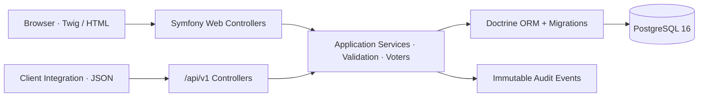

# PartnerOps

> 顧問團隊與客戶共用的服務營運平台（Partner Service Operations Portal）

PartnerOps 是一個可部署、可稽核的 Symfony 後端作品：顧問團隊可集中處理客戶需求、內外部討論、服務額度與工時，客戶則只會看到屬於自己組織且允許公開的內容。核心流程採 Twig 伺服器端渲染，即使停用 JavaScript 仍可完成工作。

## 產品重點 / Highlights

- 需求從建立、指派、優先級調整到狀態轉換的完整工作流
- 客戶隔離與 internal/client-visible 討論邊界
- 以整數分鐘計算服務額度、剩餘量與超額使用
- 不可變更的工時與 audit event，保留操作脈絡
- Client-scoped JSON API、雜湊 token、rate limiting 與 24 小時 idempotency replay
- 獨立 liveness/readiness probe、PostgreSQL migration 與 production image
- PostgreSQL-backed PHPUnit、Twig/YAML/container lint、Composer audit 與 axe smoke gate

完整行為規格請見 [feature spec](specs/001-partner-operations/spec.md)，HTTP 介面以 [OpenAPI 3.1 contract](specs/001-partner-operations/contracts/openapi.yaml) 為準。

## 品質工程案例 / Release Confidence Lab

PartnerOps 另有一套從真實商業風險出發的黑箱發布驗證：Playwright
覆蓋桌面關鍵流程、320px 響應式 Web、跨客戶隔離與 API idempotency；
手動 performance workflow 則以 10,000 筆合成資料執行既有 sequential
benchmark 與 k6 concurrent load。所有結果都區分本機／GitHub runner，
不包裝成 production SLA。

- [實作規格與決策](specs/002-quality-engineering-case/plan.md)
- [測試計畫與需求追溯](docs/quality/test-plan.md)
- [執行報告與 Go/No-Go](docs/quality/test-report.md)
- [真實缺陷案例：PostgreSQL replay key order](docs/quality/defects/BUG-001-idempotency-replay.md)
- [CI workflow](.github/workflows/ci.yml) · [手動效能 workflow](.github/workflows/performance.yml)

公開驗證皆對應 commit `8e3f801`：

- [品質 CI 29687395199](https://github.com/419vive/partnerops/actions/runs/29687395199)：
  PHPUnit 39 tests／572 assertions、Playwright desktop／320px responsive
  Web／API 共 4/4，並通過 PHPStan、OpenAPI、dependency audits、login-page
  axe 與 production image smoke。
- [效能證據 29687399527](https://github.com/419vive/partnerops/actions/runs/29687399527)：
  GitHub-hosted Linux X64 runner、production Apache image、10,000 筆合成資料；
  sequential dashboard／filtered queue p95 為 37／24 ms，10 VU／60 秒 k6
  p95 為 199.83／135.65 ms，兩路 failure rate 皆 0%、checks 皆 100%。

這些數值是可重現的 non-production release evidence，不代表正式環境
SLA、容量或可承載使用者數；完整 provenance、失敗歷程與限制見測試報告。

```bash
npm ci
npm run test:e2e:install
npm run test:e2e
```

完整的環境重建、單一 project 診斷與 performance 指令請見
[quality quickstart](specs/002-quality-engineering-case/quickstart.md)。

## 架構 / Architecture



Web 與 API 僅在 HTTP adapter 分流，共用同一套 service、repository、validation 與 authorization policy，避免兩份商業規則逐漸不一致。

| Layer | Choice |
|---|---|
| Runtime | PHP 8.4, Symfony 7.4 LTS, Apache |
| UI | Twig, semantic HTML, modern CSS, AssetMapper |
| Data | PostgreSQL 16, Doctrine ORM / Migrations |
| Security | Symfony Security, CSRF, voters, hashed opaque API tokens |
| Verification | PHPUnit 13, PHPStan level 8, Symfony linters, Composer audit, Redocly OpenAPI lint, axe-core CLI |
| Delivery | Docker multi-stage image, Compose, GitHub Actions |

## 5 分鐘啟動 / Quick demo

需求：Docker Desktop/Engine 27+ 與 Compose v2。

```bash
docker compose up --build -d db app
docker compose exec app php bin/console doctrine:database:drop --force --if-exists
docker compose exec app php bin/console doctrine:database:create
docker compose exec app php bin/console doctrine:migrations:migrate --no-interaction
docker compose exec app php bin/console doctrine:fixtures:load --group=AppFixtures --append --no-interaction
curl --fail http://localhost:8080/health/ready
```

開啟 <http://localhost:8080/login>：

| Role | Email | Password |
|---|---|---|
| Administrator | `admin@partnerops.test` | `PartnerOps!2026` |
| Team member | `agent@partnerops.test` | `PartnerOps!2026` |
| Acme client | `client@acme.test` | `PartnerOps!2026` |
| Globex client | `client@globex.test` | `PartnerOps!2026` |

這些帳密及 fixture token 僅供合成資料的本機展示。上述流程每次都會先完整重建本機 `partnerops` 資料庫，因此可以安全重跑；這也是必要步驟，因為 append-only audit log 會拒絕 fixtures 預設 purge 所發出的 `DELETE`。不要單獨省略 `--append` 執行 fixture，也絕對不要在正式環境執行 drop 或 fixture；production migration 應依下方 release job 流程單獨執行。容器啟動刻意不自動執行這些命令，避免部署時發生未審核的資料變更。

更完整的瀏覽器、隔離、額度與 API 驗收流程收錄於 [quickstart validation guide](specs/001-partner-operations/quickstart.md)。

## 常用指令 / Commands

```bash
# Backend release gate
docker compose exec app composer verify

# API contract（Node.js 22+）
npm ci && npm run api:lint

# Accessibility smoke（在 app 已啟動時，Node.js 22+）
npm ci
npm run a11y:install-browser
source "$HOME/.browser-driver-manager/.env"
npm run a11y -- \
  --chrome-path="$CHROME_TEST_PATH" \
  --chromedriver-path="$CHROMEDRIVER_TEST_PATH"

# Health probes
curl --fail http://localhost:8080/health/live
curl --fail http://localhost:8080/health/ready

# Cleanup local synthetic data
docker compose down --volumes
```

`composer test` 與 `composer verify` 會先重建隔離的測試資料庫；安全檢查只允許 PostgreSQL `_test` 後綴，或專案 `var/` 內檔名含 `_test` 的 SQLite，拒絕刪除其他目標。

CI 使用 PostgreSQL 16 service 執行 migration/schema 驗證、lint、測試與 production asset compile，最後再建置 production Docker target。axe 會掃描實際啟動的 public login page；登入後的 client isolation 與語意結構由 HTTP/DOM tests 驗證，避免把登入重導頁誤當成受保護頁面的掃描結果。

## API

公開介面目前為：

- `GET /health/live`
- `GET /health/ready`
- `POST /api/v1/requests`
- `GET /api/v1/requests/{publicId}`

Authentication、idempotency header、Problem Details 錯誤格式與 schema 範例請直接參閱 [OpenAPI contract](specs/001-partner-operations/contracts/openapi.yaml)。可重現的 `curl` 範例位於 [quickstart](specs/001-partner-operations/quickstart.md#6-validate-the-json-contract-and-idempotency)。
請求詳情的公開留言以 `commentsPage` 分頁，每頁 50 筆；回應內 `commentsPagination` 提供總筆數與總頁數，因此長期案件不會靜默遺失舊討論。

## 安全與資料完整性 / Security

- Client ownership 永遠由登入身份或 API credential 推導，不接受 request body 的 `client_id`
- Collection query scope、object voter 與 service guard 共同防止 cross-client access
- Browser mutation 使用 CSRF；API secret 僅保存 keyed digest，plaintext 只顯示一次
- PostgreSQL constraint 負責唯一性、正數分鐘、額度區間不重疊與 idempotency concurrency
- Optimistic locking 防止瀏覽器長時間停留造成 silent overwrite
- Audit metadata 採 allow-list，不保存 token、密碼、header、request body 或私密留言
- `health/live` 不依賴資料庫；`health/ready` 的交易內 `SELECT 1` 有 2 秒 PostgreSQL statement timeout，production image 另以 3 秒 `PGCONNECT_TIMEOUT` 限制建立連線

## 效能驗證 / Performance

只在可丟棄的本機資料庫載入 performance fixture：

```bash
docker compose exec app php bin/console doctrine:fixtures:load --group=performance --append --no-interaction
./scripts/benchmark.sh http://localhost:8080
```

獨立的 `performance` fixture 會附加 10,000 筆可辨識的合成請求；重複執行不會再次插入。腳本會以 demo team member 登入，暖機後量測 dashboard 與 `in_progress` 篩選清單第一頁的 HTTP time-to-first-byte p95；預設各 30 次、門檻 750 ms。路徑、帳密、樣本數與門檻皆可透過 `BENCH_*` 環境變數覆寫。

## Production image

```bash
docker build --target production -t partnerops:latest .
```

Production target 使用 non-root `www-data`、root-owned application code、OPcache、Apache security headers 與獨立 writable `var/`。部署時至少注入以下 secrets/config：

- `APP_ENV=prod`、`APP_DEBUG=0`
- 高熵 `APP_SECRET`
- PostgreSQL `DATABASE_URL`
- 與資料庫分開保管的高熵 `API_TOKEN_PEPPER`
- `APP_TIMEZONE=Asia/Taipei` 與 HTTPS 對外 `DEFAULT_URI`
- 僅列出實際 edge/load balancer 位址或 CIDR 的 `SYMFONY_TRUSTED_PROXIES`（逗號分隔）

TLS/HSTS、edge rate limiting、secret rotation、備份與 migration rollout 應由部署平台處理。application container 應只接受受控 edge 的私有網路流量；edge 必須移除外部傳入值後重寫 `X-Forwarded-For`、`X-Forwarded-Proto` 與 `X-Forwarded-Port`。例如 edge 位於 `10.20.0.0/24` 時設定 `SYMFONY_TRUSTED_PROXIES=10.20.0.0/24`；不要使用 `0.0.0.0/0`、所有 private ranges 或未受控的 `REMOTE_ADDR`。正式環境 session cookie 無條件標記 `Secure`，未列入信任的來源所送 forwarded headers 不會影響 client IP 或 scheme 判斷。

排程平台應以 singleton job 每小時執行 `php bin/console app:idempotency:prune --env=prod --no-interaction`，不要讓多個 cleanup workers 同時競爭同一批資料。指令預設每批 1,000 筆、每次最多 100 批並逐批提交，避免 24 小時 replay records 無限累積或以單一大型交易長時間鎖表；若積壓較大，可在監控資料庫負載下調整 `--batch-size` 與 `--max-batches`。

Production image 已將 libpq `PGCONNECT_TIMEOUT` 預設為 3 秒；若不用此 image 部署，必須在 PHP/Apache 的實際 process environment 設定等效上限（只寫在未匯出至 process 的 dotenv 檔不保證 libpq 會讀取）。首次套用 `Version20260718000100` 前，先在低流量時段重複執行 prune 到沒有積壓；該 migration 會取得 `idempotency_record` 的 exclusive lock 並單次重寫 24 小時內的 bounded rows。每次 release 先以一次性 job 明確執行 `php bin/console doctrine:migrations:migrate --no-interaction`，成功後再切換 application traffic；production container 本身不會修改 schema。

## Scope

第一版刻意不加入 SPA、queue、Redis、billing、email、attachment、webhook 與 realtime。當量測結果或明確產品需求需要時再擴充，避免增加目前無法驗證的營運成本。

License: [MIT](LICENSE).
